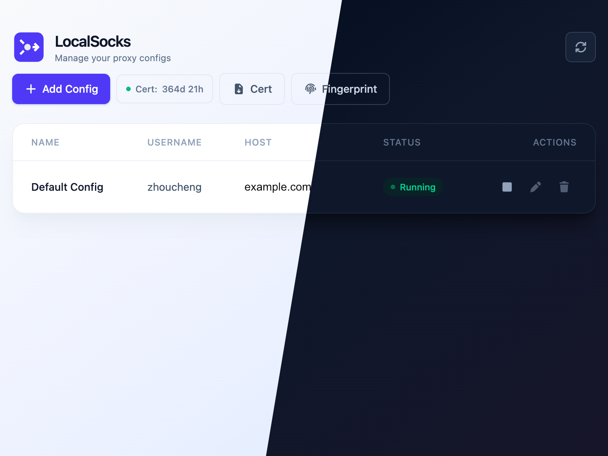
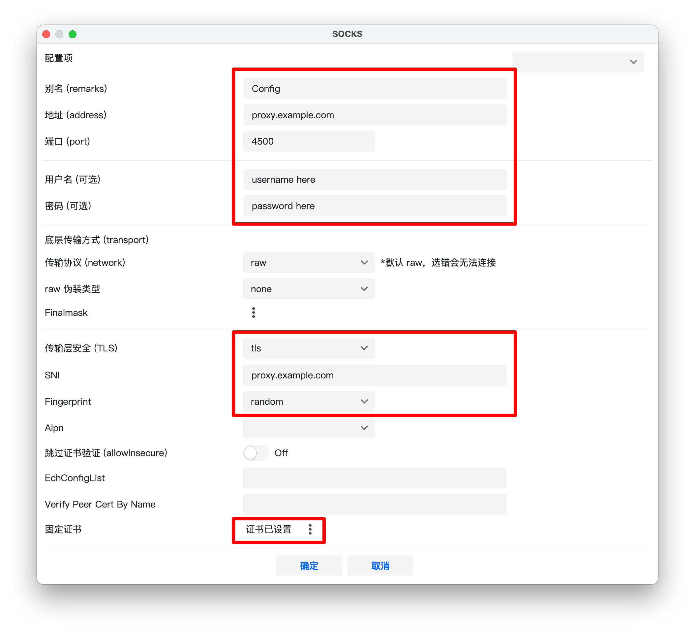
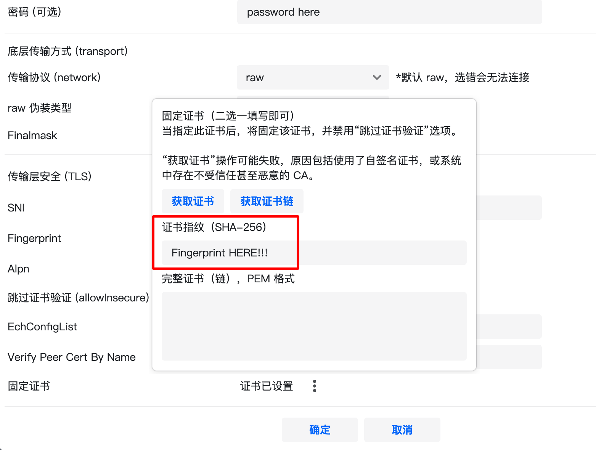

# LocalSocks

</img>


## Intro

A Socks5 (Over TLS) VPN server tool with a WebUI, deployed on Docker.

## Screenshots



## Features

- **Socks5 over TLS** — Encrypts Socks5 traffic through TLS for enhanced security
- **WebUI Management** — React-based visual dashboard for managing proxy configurations
- **Dark Mode** — Auto-detects system theme and supports manual toggle
- **Multi-config Support** — Add, edit, and delete multiple proxy configurations
- **Auto Certificate Generation** — Automatically generates self-signed TLS certificates for the specified host on startup
- **Auto Certificate Renewal** — Checks every hour and automatically renews the certificate 30 days before expiration
- **Certificate Management** — Download certificates, view fingerprints, and check remaining validity
- **Auto Recovery** — Automatically restores the previously running proxy service after container restart

## Quick Start

### Server Side

```bash
sudo docker run -d \
  --restart always \
  -v <database_dir>:/app/db \
  -p <webui_port>:80 \
  -p <socks_service_port>:4500 \
  --name socks \
  zhouc1230/local-socks:latest
```

**Parameters:**

| Parameter | Description | Example |
|---|---|---|
| `<database_dir>` | Local directory for database persistence | `/opt/localsocks/data` |
| `<webui_port>` | Port for the WebUI | `8080` |
| `<socks_service_port>` | Port for the Socks5 TLS service | `4500` |

**Example:**

```bash
sudo docker run -d \
  --restart always \
  -v /opt/localsocks/data:/app/db \
  -p 8080:80 \
  -p 4500:4500 \
  --name socks \
  zhouc1230/local-socks:latest
```

After starting, visit `http://<your_ip>:8080` to access the WebUI. You will need to register an account on first use.

1. Start the container and open the WebUI in your browser
2. On first use, you will be redirected to the registration page to create an admin account
3. Add a proxy configuration in the Dashboard (Name / Host / Username / Password)
4. Click the play button to start the proxy service
5. Connect to `<your_ip>:<socks_service_port>` with a TLS-capable Socks5 client, using the configured Username and Password

### Client Side

> [!IMPORTANT]
> When the certificate updated, you should update your client configuration as well

Please use `Socks over TLS` as the proxy. If your client does not list an `over TLS` option separately, then please select `Socks` as the proxy. I will use [v2rayN](https://github.com/2dust/v2rayN) as an example below.

You need to modify the part in the red box in the form:



The `certification` is configured as follows.

> [!NOTE]
> Fingerprint like: `AA:BB:CC:DD...`



> [!IMPORTANT]
> Most proxy clients do not proxy traffic from local area network addresses (e.g. `192.168.x.x`); you need to manually modify this.  
> In [v2rayN](https://github.com/2dust/v2rayN), the default latency test address is Google. If your proxy server is located in mainland China, you may need to change it.

The `tunnel.conf` file in this repository is a configuration file for Shadowrocket that routes all traffic through your proxy.

## Update

```bash
sudo docker stop socks && sudo docker rm socks

sudo docker run -d \
  --restart always \
  -v <database_dir>:/app/db \
  -p <webui_port>:80 \
  -p <socks_service_port>:4500 \
  --name socks \
  zhouc1230/local-socks:latest
```

> Data is stored in `<database_dir>`. Simply re-run the container to update — your configurations will be preserved.